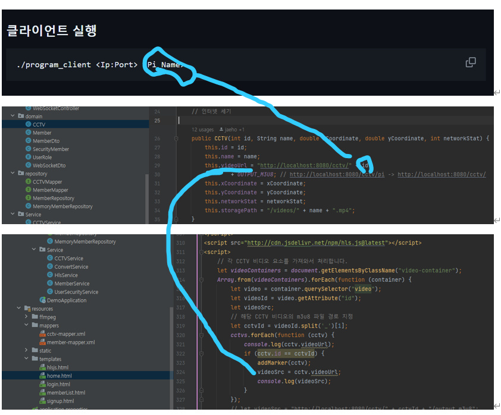
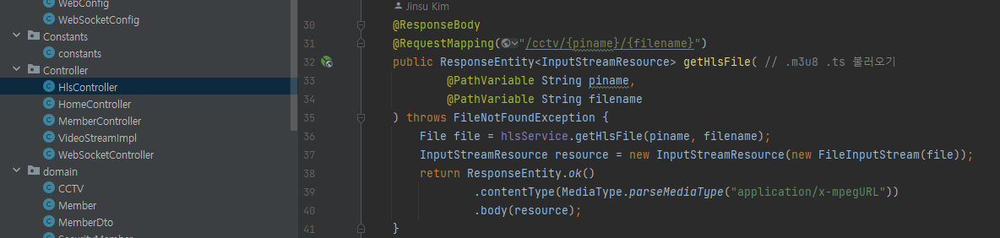

# 개요
- 첫 화면에 로그인/회원가입 페이지를 띄워, 로그인을 해야만 home 화면에 접속할 수 있도록 한다. home 화면에서 좌측 2/3 부분이 mapList와 dashboard가 tab으로 전화할 수 있도록 한다.
- home의 우측에는 cctv 상태 정보가 포함된 목록이 있다. cctv 목록에서 checkbox로 선택된 cctv들은 좌측 dashboard에서 영상으로 송출되고, mapList에서 marker로 위치정보를 표시한다.

## 숙지할 점!

- 데이터베이스 cctv table Primary Key id랑 DTO id 타입 일치 및 video sourece 경로 일치 중요