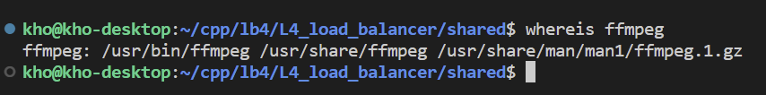

# Spring boot + gRPC + HLS Template

- \src\main\resources\application.yml 파일에서 gRPC 포트 번호 조정 가능

- \src\main\resources\application.properties에서 개발 혹은 배포를 하는 OS를 지정해주고 구동시켜야 함

- 지정된 OS에 따라 application-지정OS.properties 파일이 적용됨

- window의 경우 .m3u8 .ts 등의 파일들이 저장되는 절대경로를 개발 환경에 맞게 조정해줘야함

- linux의 경우 상대경로로 해서 괜찮을듯 하지만 만약 안된다면 역시 위와 같은 방법으로 배포 환경에 맞게 경로를 지정해줘야함

- 리눅스(우분투)의 경우 ffmpeg, ffprobe 경로를 배포환경에 맞게 설정해줘야 함(opencv 설치 할때 ffmpeg을 특별한 경로에 저장하지 않다면 그대로 사용해도 무방할듯 보임)

- window의 경우 `ClassPathResource`를 이용해 프로젝트에 미리 넣어논 ffmpeg 위치를 자동으로 찾아주기 때문에 그대로 사용해도 무방할 듯 하나 동작이 안된다면 아래 위치의 실행 파일들을 개발환경에 맞게 바꿔야 함

[윈도우 ffmpeg 다운](https://ffmpeg.org/download.html#build-windows)

- hlsjs.html에서 서버의 ip와 port로 바꿔야함

